# Sonarqube Workshop

**Miguel Angel Gonzalez - A00395687**

This report takes as made the deployment of an azure virtual machine, with port 9001 enabled for public ip access.

## Creating files for deployment with Ansible.

The Ansible configuration is given by the following folder and file layout:

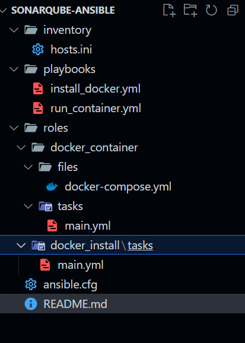

A docker-compose is defined that contains a postgress image (here the configurations, credentials and other data will be stored) and the sonarqube image:

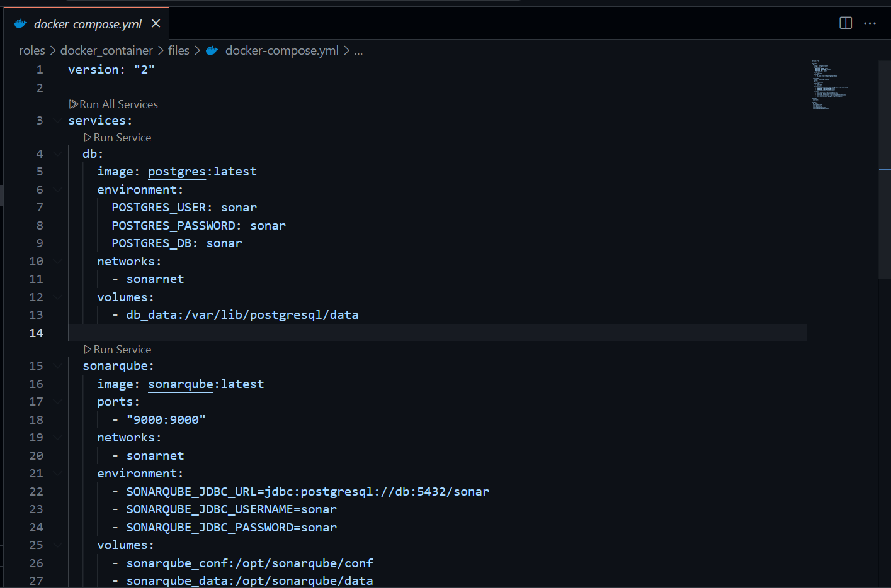

We set the steps for the installation of docker in our vm:

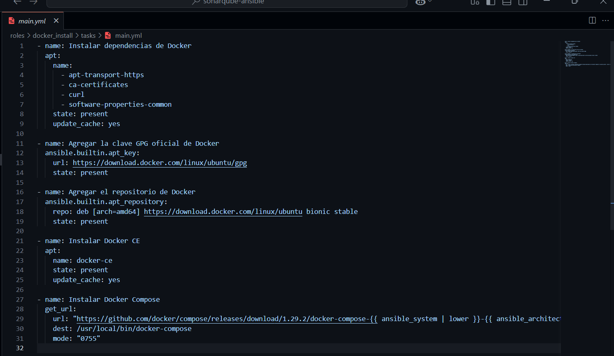

Then, we set up the steps for the deploy of the containers in our vm:

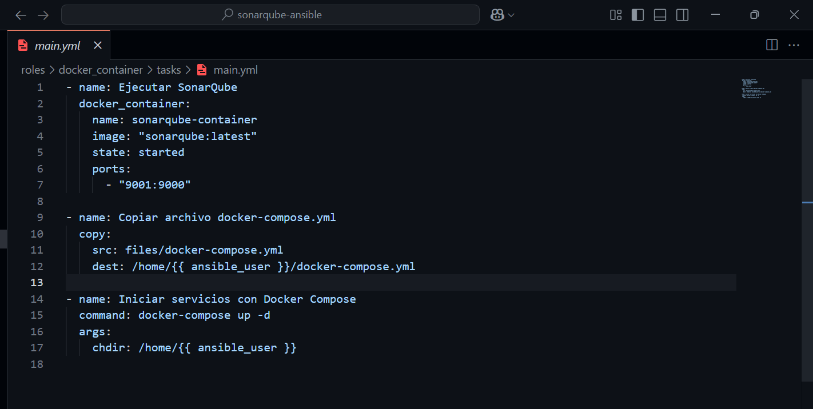

First we execute the steps for the installation of docker and then for the execution of Sonaqube:

```
ansible-playbook -i inventory/hosts.ini playbooks/install_docker.yml
```

```
ansible-playbook -i inventory/hosts.ini playbooks/run_container.yml
```

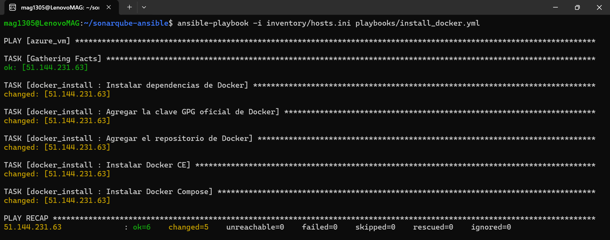

It must be emphasized that the public IP address of the vm must be set in `host.ini` and verify that the port is open.

## Accessing Sonarqube

Once the containers are deployed on the vm, we will be able to access Sonarqube through the public IP and the specified port:

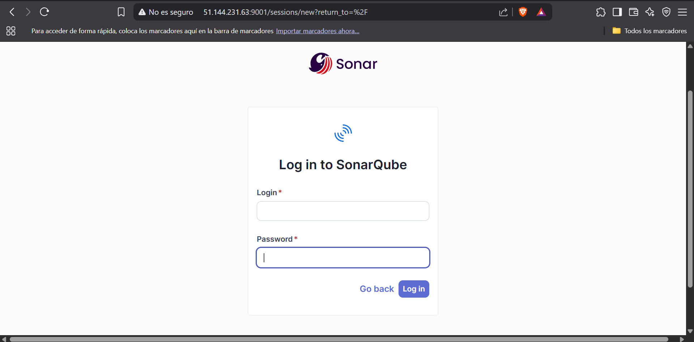

The default login credentials are `admin`, both for username and password. Once logged in, you will be prompted for a new password:

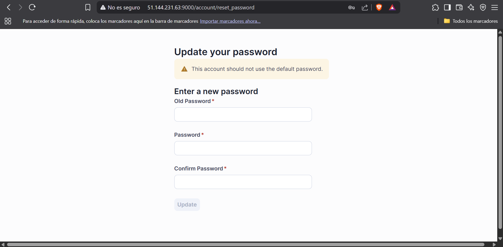

Once the password has been changed, we will have access to the Sonarqube panel:

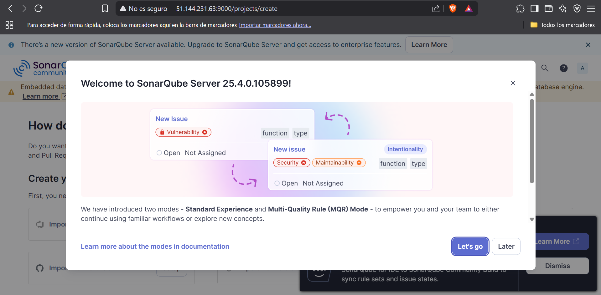

## Linking Sonarqube to a github repository

To do this the first thing to do is to generate a sonar token, this will allow the link to be made without the need to enter credentials. To generate this token it is necessary to go to “administration > security > users”. Once here we select the user (admin in this case) and generate a token for it:

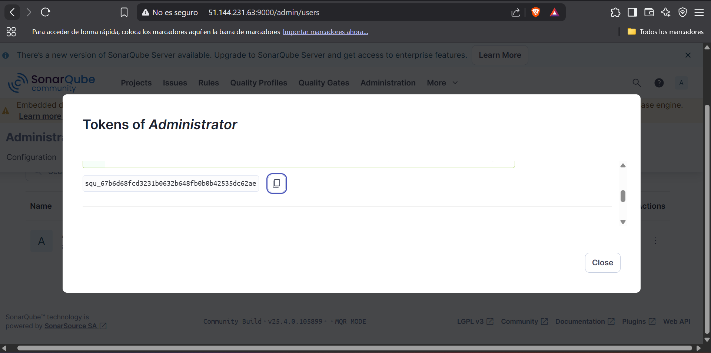

We also generate a github token with permissions on workflows (User > Settings > DeveloperSettings > PersonalAcessTokens > ClassicsToken > GenerateNewToken). We make sure to save these tokens in a local file and add them as secrets in our project repository (RepositorySettings > SecretsAndVariables > Actions > NewRepositorySecret).

Once the configuration of the secrets is finished, we go to the repository actions and create a new workflow, creating a `sonarqube.yml` that will synchronize the repo with the panel:

```
name: SonarQube Analysis

on:
  push:
    branches:
      - main

jobs:
  sonarQube:
    name: SonarQube analysis
    runs-on: ubuntu-latest

    steps:
      - name: Checkout source code
        uses: actions/checkout@v3

      - name: Set up Java
        uses: actions/setup-java@v3
        with:
          java-version: '17'
          distribution: 'temurin'

      - name: SonarQube Scan
        env:
          SONAR_TOKEN: ${{ secrets.SONAR_TOKEN }}
        run: |
          wget https://binaries.sonarsource.com/Distribution/sonar-scanner-cli/sonar-scanner-cli-5.0.1.3006-linux.zip
          unzip sonar-scanner-cli-5.0.1.3006-linux.zip
          export PATH="$PWD/sonar-scanner-5.0.1.3006-linux/bin:$PATH"
          sonar-scanner \
            -Dsonar.projectKey=mi-proyecto \
            -Dsonar.sources=. \
            -Dsonar.host.url=http://<PUBLIC_IP>:<PORT> \
            -Dsonar.login=$SONAR_TOKEN
```

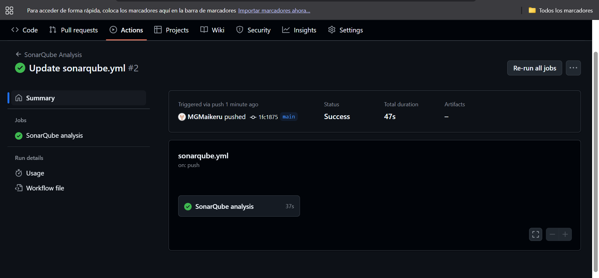

When the execution of the action is finished, we can go to our panel:

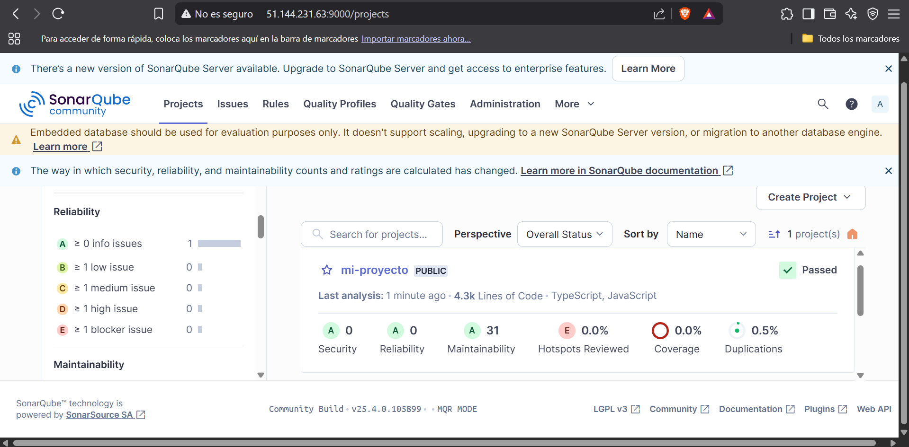

## Configuring Sonarqube to jest

If we look at the image above, we see that no evidence is being recognized. The repo that was synchronized in this case was `https://github.com/MGMaikeru/car-link-express`, which has tests performed in jest. These tests are not recognized by sonar by default, being necessary some modifications in the repository.

The problem of Sonar not detecting the tests is usually due to the fact that Jest does not generate the reports in the format that SonarQube expects by default. First we add the `jest-unit` dependency:

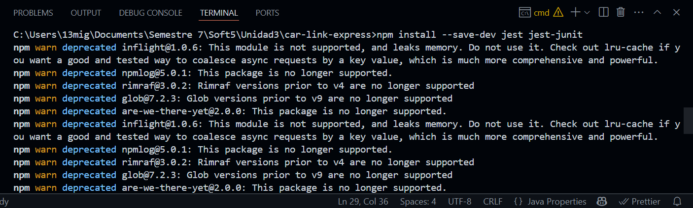

A few lines are added to `jest.config.js` to set a sonar compatible format and assign jest-junit to process the results:

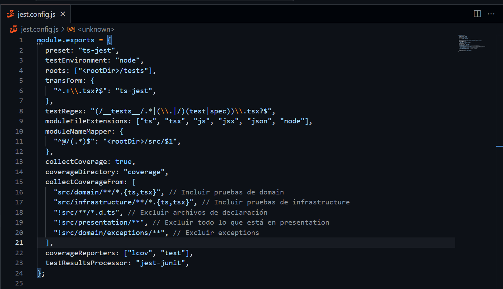

Finally, the project tests are run so that the report is stored in the proper format.

_If in your action in github you have well configured the parameters for the association with Sonar, these steps are enough to load the tests in Sonar, we just need commit changes and push. Next, it is shown how to make this association locally._

A sonar-project.properties is created where the necessary configurations are established, such as project language, test file extensions, among others:

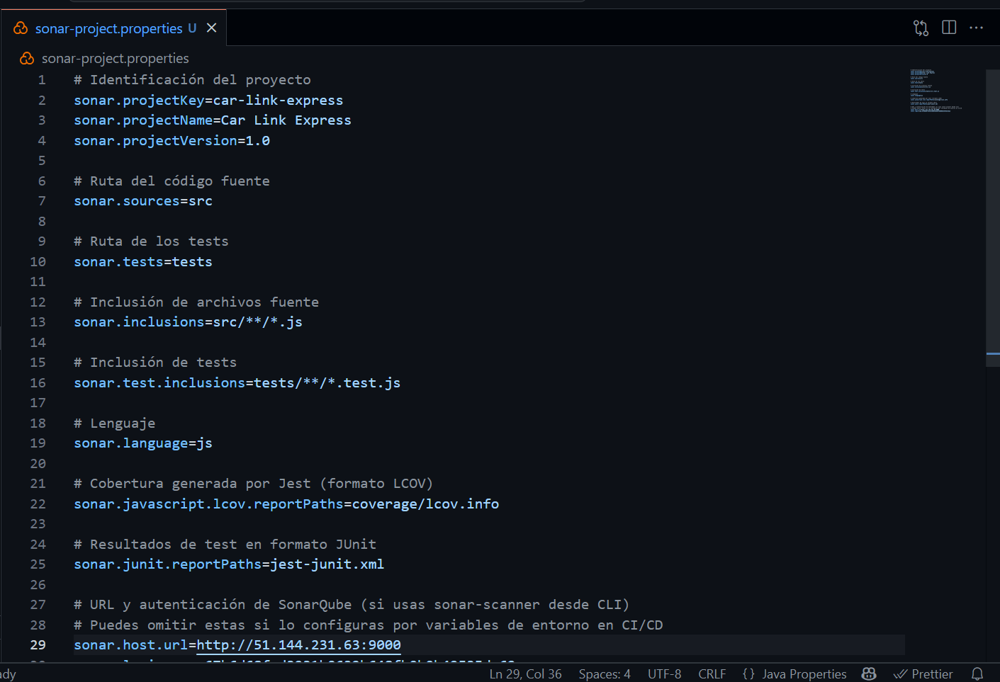

We added `sonar-scanner` as a project dependency:

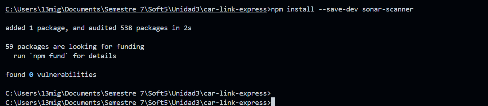

We can add an execution alias for sonnar to the `package.json` of the project:

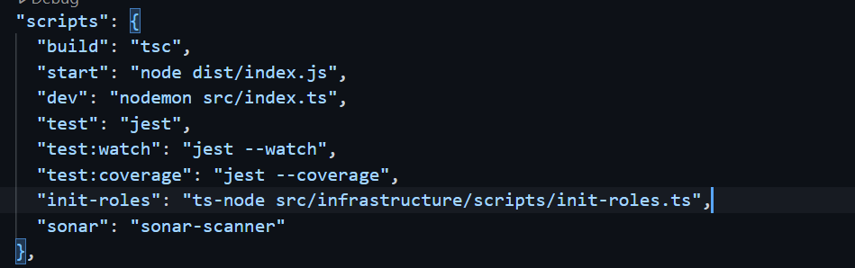

Ejecutamos el comando de sonnar-scanner segun lo hayamos configurado en scripts, en mi caso `npm run sonnar`:

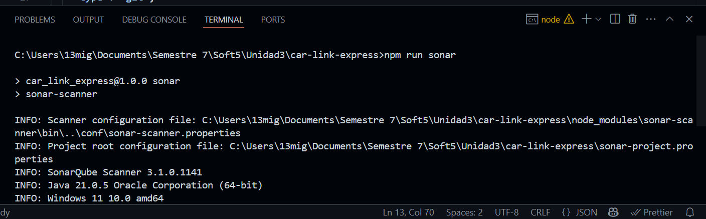

Finally we check in the panel this association and how we can access to the coverage details of the tests:

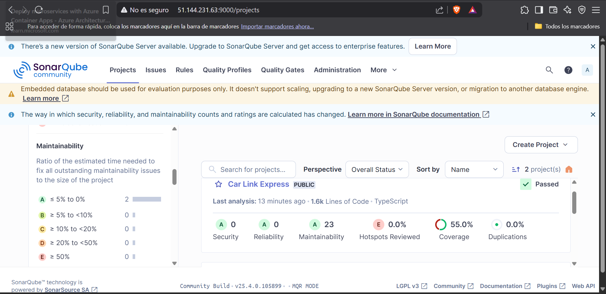

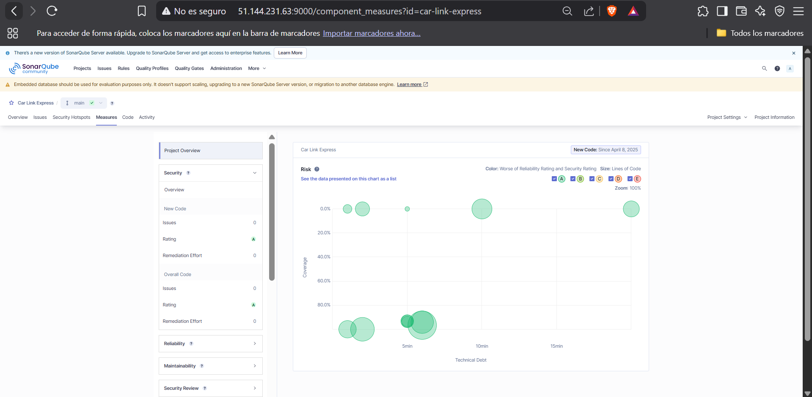

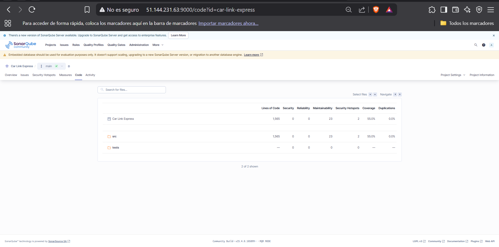
